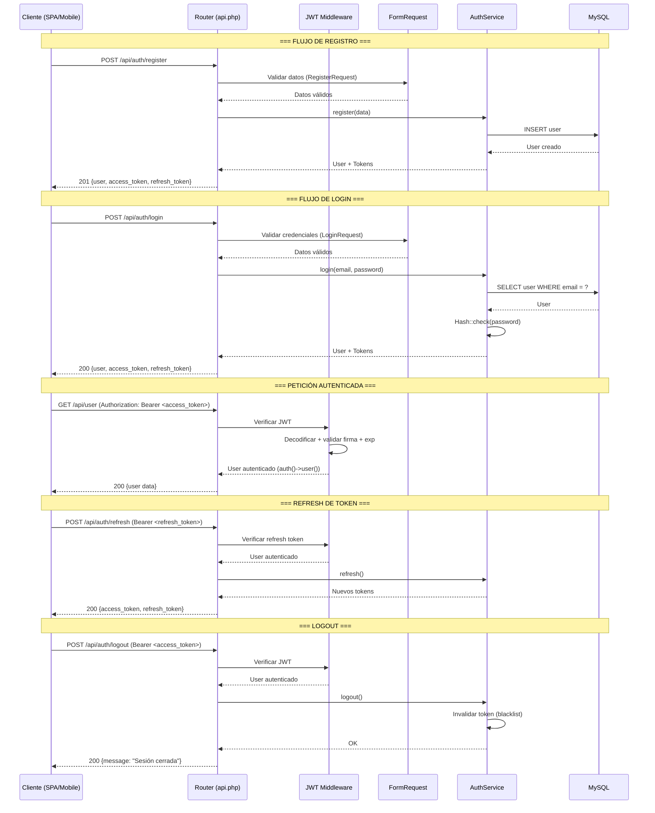

# Parte 1 — Fundamentos del Proyecto, Setup y Arquitectura

---

## 1. Introducción al Manual

### Propósito

Este manual es una guía completa para implementar un sistema de autenticación y autorización robusto, seguro y mantenible sobre PHP/Laravel. Está diseñado para desarrolladores con experiencia básica-intermedia en PHP que necesitan llevar su sistema de login al siguiente nivel — desde cero hasta un sistema listo para producción con seguridad avanzada y testing automatizado.

No es un tutorial de "copiar y pegar". Cada decisión de arquitectura, cada patrón y cada línea de código están justificadas con razonamiento técnico. Al terminar, el lector no solo tendrá un sistema funcional, sino que entenderá el POR QUÉ de cada pieza.

### Stack Tecnológico

| Componente       | Tecnología              | Versión Mínima |
|------------------|-------------------------|----------------|
| Lenguaje         | PHP                     | 8.2+           |
| Framework        | Laravel                 | 11.x           |
| Base de Datos    | MySQL                   | 8.0+           |
| Autenticación    | JWT (JSON Web Tokens)   | tymon/jwt-auth |
| Configuración    | `.env`                  | —              |
| Dependencias     | Composer                | 2.x            |
| Assets Frontend  | Node.js / npm           | 20.x LTS       |

### ¿Qué Aprenderá el Lector?

Al completar las partes de este manual, el lector será capaz de:

- Configurar un proyecto Laravel desde cero con autenticación JWT stateless.
- Diseñar una arquitectura en capas que separe responsabilidades: Controllers, FormRequests, Services, Repositories y Models.
- Implementar registro, login, logout, refresh de tokens y verificación de email.
- Proteger rutas con middleware JWT personalizado y políticas de autorización.
- Aplicar seguridad avanzada: rate limiting, CORS, headers de seguridad, protección contra ataques comunes (CSRF, XSS, SQL Injection, timing attacks).
- Escribir tests unitarios y de feature que validen cada flujo de autenticación.
- Integrar el sistema con un frontend SPA (React/Vue) o aplicación mobile.

### Prerrequisitos

Antes de comenzar, asegúrese de tener instalado:

- **PHP 8.2+** con las extensiones: `bcmath`, `ctype`, `fileinfo`, `json`, `mbstring`, `openssl`, `pdo`, `pdo_mysql`, `tokenizer`, `xml`.
- **Composer 2.x** para gestión de dependencias PHP.
- **MySQL 8.0+** como motor de base de datos.
- **Node.js 20 LTS** y **npm** para compilación de assets básicos (solo si se usa el frontend incluido de Laravel).

Conocimientos esperados: sintaxis PHP moderna, conceptos básicos de Laravel (rutas, controladores, migraciones), HTTP y REST, fundamentos de bases de datos relacionales.

---

## 2. ¿Por Qué Laravel? (Decisión de Arquitectura)

### Comparativa: Laravel vs Symfony vs Slim vs PHP Puro

| Framework    | Curva de Aprendizaje | Autenticación | ORM/DB        | Middleware | Ecosistema        |
|-------------|---------------------|---------------|---------------|------------|-------------------|
| **Laravel** | Media               | Nativa + paquetes | Eloquent (activo) | Pipeline integrado | Extenso           |
| Symfony     | Alta                | Security component | Doctrine (data mapper) | Event dispatcher | Muy extenso       |
| Slim        | Baja                | Manual        | Manual        | Middleware stack | Mínimo            |
| PHP Puro    | —                   | Manual        | Manual        | Manual       | Inexistente       |

**Laravel** ofrece el mejor balance entre potencia y productividad. Symfony es más explícito y modular — ideal para proyectos enterprise con requisitos muy específicos. Slim y PHP puro requieren implementar todo desde cero, lo cual es inviable para un sistema de auth que debe ser seguro y mantenible.

### Ventajas de Laravel para Autenticación

- **Hashing integrado**: `Hash::make()` usa bcrypt por defecto con factor de trabajo configurable. No hay que tocar `password_hash()` manualmente ni preocuparse por salts.

- **Middleware Pipeline**: Cada request atraviesa una cadena de middlewares. La autenticación JWT se inserta como un middleware más, sin contaminar los controladores.

    ```
    Request → CORS → Auth (JWT) → Rate Limiter → Controller → Response
    ```

- **Eloquent ORM**: El modelo `User` se integra directamente con JWT para resolver la identidad del usuario autenticado en cada request.

- **Validación declarativa**: Los FormRequests permiten validar datos de entrada antes de que lleguen a la lógica de negocio. Las reglas son legibles, reutilizables y testables.

- **Rate Limiting nativo**: `RateLimiter` de Laravel permite proteger endpoints de login y registro contra fuerza bruta sin dependencias externas.

### El Ecosistema de Autenticación en Laravel

Laravel ofrece tres caminos principales para autenticación. Elegir el correcto ES una decisión de arquitectura que condiciona todo lo demás:

| Solución         | Tipo de Auth | Caso de Uso Ideal                          | Estado    |
|------------------|-------------|--------------------------------------------|-----------|
| **Sanctum**      | Token/Sesión | SPA (React, Vue) mismo dominio; Mobile con tokens simples | Stateful o stateless |
| **Passport**     | OAuth2      | APIs que necesitan OAuth2 completo (third-party, scopes complejos) | OAuth2 server |
| **JWT puro**     | JWT stateless | APIs REST stateless para SPA + mobile; microservicios | Stateless |

**Sanctum** es ideal cuando el frontend vive en el mismo dominio (cookies de sesión) o cuando los tokens pueden almacenarse en base de datos (no es JWT real, es un token opaco).

**Passport** implementa un servidor OAuth2 completo. Es overkill si no se necesita el protocolo OAuth2 — su complejidad es considerable y requiere entender grants, scopes y flujos OAuth.

### Decisión para Este Manual: JWT Puro con `tymon/jwt-auth`

Se eligió **JWT puro** con el paquete `tymon/jwt-auth` por las siguientes razones técnicas:

1. **Stateless**: El servidor no almacena sesiones. Cada token contiene toda la información necesaria para identificar al usuario. Esto elimina consultas a base de datos para verificar sesiones en cada request.
2. **Mobile-friendly**: Los tokens JWT viajan en el header `Authorization: Bearer <token>`, lo cual funciona nativamente en cualquier cliente HTTP (Axios, Fetch, Retrofit, Alamofire).
3. **SPA-ready**: El token puede almacenarse en httpOnly cookies o en memoria, y enviarse en cada request sin configuración adicional.
4. **Escalabilidad horizontal**: Al no depender de sesiones en servidor, múltiples instancias de la API pueden validar tokens sin compartir estado.

El paquete `tymon/jwt-auth` es el estándar de facto para JWT en Laravel, con más de una década de madurez y mantenimiento activo.

---

## 3. Arquitectura de Autenticación (Conceptual)

### Diagrama Conceptual del Sistema



### Flujo de Autenticación Completo

El sistema implementa cinco flujos principales:

1. **Registro**: El cliente envía `name`, `email`, `password`, `password_confirmation`. El sistema valida, crea el usuario, y devuelve tokens JWT.
2. **Login**: El cliente envía `email` y `password`. El sistema verifica credenciales y devuelve tokens JWT.
3. **Peticiones autenticadas**: Cada request incluye el access token en el header `Authorization: Bearer <token>`. El middleware JWT lo decodifica, valida firma, expiración, y resuelve el usuario.
4. **Refresh de token**: Cuando el access token expira, el cliente envía el refresh token para obtener un nuevo par de tokens sin re-autenticarse.
5. **Logout**: El access token se invalida (se agrega a una blacklist). El refresh token también se invalida.

### Modelo de Capas

La arquitectura sigue el principio de separación de responsabilidades en capas bien definidas:

```
┌─────────────────────────────────────────────┐
│  HTTP Layer (Controllers, Middleware)        │  ← Entrada/Salida HTTP
├─────────────────────────────────────────────┤
│  Validation Layer (FormRequests)             │  ← Validación de datos
├─────────────────────────────────────────────┤
│  Service Layer (AuthService, UserService)    │  ← Lógica de negocio
├─────────────────────────────────────────────┤
│  Data Layer (Models, Repositories)           │  ← Persistencia
├─────────────────────────────────────────────┤
│  Infrastructure (MySQL, Redis, Mail)         │  ← Servicios externos
└─────────────────────────────────────────────┘
```

**Cada capa tiene una responsabilidad exclusiva:**

- **Controllers**: Recibir la request HTTP, delegar al Service Layer, devolver respuesta HTTP. Nunca contienen lógica de negocio.
- **FormRequests**: Validar datos de entrada (authorize + rules). Si falla la validación, Laravel retorna 422 automáticamente.
- **Service Layer**: Toda la lógica de negocio vive aquí. El `AuthService` orquesta registro, login, refresh y logout. Los controllers solo llaman métodos del service.
- **Models/Repositories**: Acceso a datos. Eloquent Models para operaciones CRUD básicas. Si se necesita desacoplar más, se agrega un Repository Pattern.

### Dónde Vive la Lógica de Negocio

**Regla de oro**: La lógica de negocio NUNCA vive en controllers. Los controllers son adaptadores HTTP — traducen requests a llamadas de servicio y respuestas de servicio a responses HTTP.

Un controller correcto se ve así:

```php
final class LoginController extends Controller
{
    public function __construct(
        private readonly AuthService $authService
    ) {}

    public function __invoke(LoginRequest $request): JsonResponse
    {
        $result = $this->authService->login(
            email: $request->validated('email'),
            password: $request->validated('password')
        );

        return response()->json($result, 200);
    }
}
```

No hay `if`, no hay lógica de negocio, no hay acceso a base de datos. Solo delegación.

### Stateless JWT: Qué Significa

**Stateless** significa que el servidor no mantiene ningún estado de sesión entre requests. Toda la información necesaria para autenticar al usuario está dentro del token JWT.

**Implicaciones:**

- El servidor no consulta la base de datos para verificar si la sesión es válida (solo verifica la firma y expiración del token).
- Cualquier instancia del servidor puede validar el token sin compartir estado.
- La invalidación inmediata de tokens (logout) requiere una blacklist, lo cual reintroduce algo de estado.

**Ventajas:**

- Escalabilidad horizontal sin sticky sessions ni almacenamiento compartido de sesiones.
- Menor latencia: no hay consulta a base de datos por request autenticado.

**Desventajas:**

- El token no puede invalidarse remotamente sin blacklist.
- Si un token es robado, es válido hasta que expire.
- El payload del token viaja en cada request (overhead de ~1-2 KB).

### Access Token vs Refresh Token

| Característica    | Access Token                  | Refresh Token                 |
|-------------------|-------------------------------|-------------------------------|
| Propósito          | Autenticar requests           | Obtener nuevos access tokens  |
| Lifetime típico    | 15-60 minutos                 | 7-30 días                     |
| Contiene           | Claims del usuario            | Claims mínimos (solo ID)      |
| Se envía en        | Cada request autenticado      | Solo en endpoint de refresh   |
| Almacenamiento FE  | Memoria (recomendado)         | httpOnly cookie               |
| Blacklist          | Sí (en logout)                | Sí (en logout)                |

**Estrategia de rotación**: Cuando se usa el refresh token para obtener un nuevo access token, el refresh token también se rota — se emiten ambos tokens nuevos y el refresh token anterior se invalida. Esto limita la ventana de ataque si un refresh token es comprometido.

---

## 4. Decisiones de Seguridad Fundamentales

### Password Hashing: bcrypt

Laravel usa **bcrypt** como algoritmo de hashing por defecto. Para este manual se mantiene bcrypt por:

- **Madurez**: bcrypt existe desde 1999. Ha resistido dos décadas de escrutinio criptográfico.
- **Factor de trabajo configurable**: Laravel establece el cost factor en 10 por defecto (configurable en `config/hashing.php`). Cada incremento en 1 duplica el tiempo de cómputo.
- **Resistencia a GPU**: bcrypt fue diseñado específicamente para ser ineficiente en hardware paralelo (GPUs, FPGAs).
- **Compatibilidad universal**: Soportado en todas las versiones de PHP sin extensiones adicionales.

**Argon2 vs bcrypt**: Argon2 (ganador del Password Hashing Competition 2015) es teóricamente superior — resistencia a GPU y a ataques side-channel. Sin embargo, bcrypt sigue siendo la opción más compatible y madura. Si el proyecto requiere Argon2id, Laravel lo soporta en `config/hashing.php` con un cambio de una línea.

```php
// Laravel abstrae el algoritmo — cambiar de bcrypt a argon2 es una línea de config
'default' => env('HASH_DRIVER', 'bcrypt'),
```

### JWT Signing Algorithm: HS256

| Algoritmo    | Tipo         | Clave           | Caso de Uso                         |
|-------------|-------------|-----------------|-------------------------------------|
| **HS256**   | Simétrico    | Secreto compartido | Servicio monolítico, single-server |
| RS256       | Asimétrico   | Par público/privado | Microservicios, múltiples consumidores |

Para este manual se usa **HS256** porque:

- Es el más simple: una sola clave secreta (`JWT_SECRET` en `.env`).
- El mismo servidor que emite los tokens los valida (single-server).
- Menor overhead que RS256 (clave más corta, firma más rápida).

Se usará RS256 si en el futuro se requiere que múltiples servicios independientes validen tokens sin compartir el secreto.

### Claims del JWT

Un JWT está compuesto por claims (afirmaciones) en su payload. Los claims estándar y custom para este sistema:

```json
{
  "sub": "42",                    // Subject: ID del usuario
  "iat": 1690000000,              // Issued At: timestamp de emisión
  "exp": 1690003600,              // Expiration: timestamp de expiración
  "jti": "unique-token-id",       // JWT ID: identificador único del token
  "token_type": "access",         // Custom: tipo de token (access | refresh)
  "role": "user"                  // Custom: rol del usuario
}
```

**Regla de mínimo privilegio**: El access token incluye `role` para decisiones rápidas de autorización sin consultar la base de datos. El refresh token incluye SOLO `sub`, `iat`, `exp`, y `token_type: "refresh"` — nunca incluye `role` ni otros datos sensibles.

### Token Storage en el Frontend

| Método              | XSS-safe | JS-accesible | Auto-envío | Vulnerable a CSRF |
|--------------------|----------|-------------|------------|-------------------|
| httpOnly cookie    | ✅       | ❌          | ✅         | ✅ (mitigable)     |
| localStorage       | ❌       | ✅          | ❌         | ❌                 |
| Memory (variable)  | ✅       | ✅          | ❌         | ❌                 |
| sessionStorage     | ❌       | ✅          | ❌         | ❌                 |

**Recomendación para este manual:**

- **Access Token**: Almacenar en memoria (variable JavaScript). Se pierde al cerrar la pestaña, lo cual es deseable para tokens de corta duración. Se envía manualmente en el header `Authorization: Bearer <token>`.
- **Refresh Token**: Almacenar en **httpOnly cookie** con flags `Secure`, `SameSite=Strict`, y `Path=/api/auth/refresh`. Esto lo protege de XSS (no es accesible desde JavaScript) y limita su exposición.

### HTTPS como Requisito No Negociable

En producción, **HTTPS es obligatorio**. Sin HTTPS:

- Los tokens JWT viajan en texto plano por la red.
- Las credenciales de login son visibles para cualquier intermediario.
- Los httpOnly cookies con flag `Secure` no funcionan sin HTTPS.

El entorno de desarrollo local (`localhost`) es la única excepción aceptable.

### CORS Configuration

Cross-Origin Resource Sharing (CORS) es el mecanismo que permite o deniega requests desde orígenes diferentes al de la API. Es crítico en APIs porque:

- La API (`api.tudominio.com`) y el frontend SPA (`app.tudominio.com`) son orígenes distintos.
- Sin CORS, el navegador bloquea todas las requests cross-origin por defecto (same-origin policy).

Configuración recomendada:

- `Access-Control-Allow-Origin`: Solo los orígenes explícitamente autorizados, NUNCA `*`.
- `Access-Control-Allow-Methods`: Solo los métodos HTTP usados por la API (`GET, POST, PUT, DELETE`).
- `Access-Control-Allow-Headers`: `Content-Type, Authorization, X-Requested-With`.
- `Access-Control-Allow-Credentials`: `true` (necesario para cookies httpOnly).
- `Access-Control-Max-Age`: Cachear preflight por 1 hora (3600s) para reducir requests.

---

## 5. Estructura del Proyecto

### Creación del Proyecto

```bash
composer create-project laravel/laravel paradise-api
```

### Estructura de Directorios Relevante para Auth

```
paradise-api/
├── app/
│   ├── Enums/
│   │   ├── UserRole.php              ← Roles de usuario
│   │   └── UserStatus.php            ← Estados de usuario (active, banned, etc.)
│   │
│   ├── Exceptions/
│   │   └── Auth/
│   │       ├── InvalidCredentialsException.php
│   │       └── TokenExpiredException.php
│   │
│   ├── Http/
│   │   ├── Controllers/
│   │   │   └── Auth/
│   │   │       ├── LoginController.php
│   │   │       ├── RegisterController.php
│   │   │       ├── LogoutController.php
│   │   │       ├── RefreshTokenController.php
│   │   │       └── MeController.php
│   │   │
│   │   ├── Middleware/
│   │   │   └── JwtAuthenticate.php    ← Middleware JWT personalizado
│   │   │
│   │   └── Requests/
│   │       └── Auth/
│   │           ├── LoginRequest.php
│   │           ├── RegisterRequest.php
│   │           └── RefreshTokenRequest.php
│   │
│   ├── Models/
│   │   └── User.php                  ← Modelo de usuario
│   │
│   └── Services/
│       ├── AuthService.php           ← Lógica de autenticación
│       └── Contracts/
│           └── AuthServiceInterface.php
│
├── config/
│   ├── auth.php                      ← Guards, providers, defaults
│   └── jwt.php                       ← Configuración de JWT (Parte 3)
│
├── database/
│   └── migrations/
│       └── xxxx_create_users_table.php
│
├── routes/
│   └── api.php                       ← Rutas públicas y protegidas
│
├── .env                              ← Variables de entorno
├── .env.example                      ← Template de variables
└── composer.json
```

### Responsabilidad de Cada Componente

| Directorio/Archivo                     | Responsabilidad                                                                    |
|----------------------------------------|------------------------------------------------------------------------------------|
| `app/Enums/`                           | Enumeraciones tipadas (PHP 8.1+) para roles, estados y constantes de dominio       |
| `app/Exceptions/Auth/`                 | Excepciones específicas del dominio de autenticación                               |
| `app/Http/Controllers/Auth/`           | Controladores de entrada HTTP para cada endpoint de auth                           |
| `app/Http/Middleware/JwtAuthenticate`  | Intercepta requests, valida el JWT, inyecta el usuario autenticado en la request   |
| `app/Http/Requests/Auth/`              | Validación de datos de entrada para cada endpoint de auth                          |
| `app/Models/User.php`                  | Modelo Eloquent del usuario, implementa `JWTSubject`                               |
| `app/Services/AuthService.php`         | Lógica de negocio pura: registro, login, refresh, logout                           |
| `config/auth.php`                      | Configuración de guards (api → jwt) y providers (users → eloquent)                 |
| `config/jwt.php`                       | Configuración de JWT: TTL, algoritmo, claims, blacklist (se crea en Parte 3)       |
| `routes/api.php`                       | Definición de rutas: públicas (login, register) y protegidas (user, logout)        |
| `.env`                                 | Secretos y configuración por entorno                                               |

---

## 6. Setup Inicial Paso a Paso

### Paso 1: Crear el Proyecto

```bash
composer create-project laravel/laravel paradise-api
cd paradise-api
```

Esto descarga Laravel 11.x, instala dependencias, genera el archivo `.env` desde `.env.example` y crea la clave de aplicación.

### Paso 2: Verificar .env y Clave de Aplicación

El archivo `.env` contiene las variables de entorno. Laravel lo genera automáticamente desde `.env.example`. En esta parte solo se verifica su existencia — la configuración específica para base de datos y JWT se cubre en la Parte 2.

```bash
php artisan key:generate
```

**Qué hace**: Genera una clave criptográfica aleatoria de 32 caracteres y la almacena en `APP_KEY` dentro de `.env`.

**Por qué es crítico**: Esta clave se usa para:
- Encriptar sesiones y cookies.
- Encriptar datos con `Crypt::encrypt()`.
- Firmar tokens CSRF.
- Derivar claves para el cifrado interno de Laravel.

Sin `APP_KEY`, cualquier dato encriptado por Laravel es inaccesible — incluyendo sesiones existentes y valores encriptados en base de datos.

### Paso 3: Verificar que el Proyecto Corre

```bash
php artisan serve
```

Esto inicia el servidor de desarrollo en `http://localhost:8000`. Abrir esa URL en el navegador debe mostrar la página de bienvenida de Laravel.

Para detener: `Ctrl+C`.

### Paso 4: Limpiar la Estructura por Defecto

Laravel incluye archivos de ejemplo que no se usarán en este sistema de autenticación. Eliminarlos mantiene el proyecto limpio:

```bash
# Eliminar migraciones por defecto que no se usarán
rm database/migrations/0001_01_01_000000_create_users_table.php
rm database/migrations/0001_01_01_000001_create_cache_table.php
rm database/migrations/0001_01_01_000002_create_jobs_table.php

# Eliminar modelos por defecto si existen
# El modelo User se reescribirá con la interfaz JWTSubject

# Eliminar controladores por defecto
rm app/Http/Controllers/*.php -f
```

> **Nota**: Se eliminan las migraciones por defecto porque se crearán migraciones personalizadas con todos los campos necesarios para el sistema de auth (roles, tokens, timestamps). Esto se hace en la Parte 2.

### Paso 5: Crear los Directorios de la Estructura

```bash
mkdir -p app/Enums
mkdir -p app/Exceptions/Auth
mkdir -p app/Http/Controllers/Auth
mkdir -p app/Http/Requests/Auth
mkdir -p app/Services/Contracts
```

---

## 7. Convenciones y Buenas Prácticas

### Naming Conventions

| Elemento                | Convención                       | Ejemplo                          |
|------------------------|----------------------------------|----------------------------------|
| Controladores          | PascalCase + `Controller`        | `LoginController`                |
| FormRequests           | PascalCase + `Request`           | `LoginRequest`                   |
| Services               | PascalCase + `Service`           | `AuthService`                    |
| Métodos en services    | camelCase, verbos de acción      | `login()`, `register()`, `refreshTokens()` |
| Métodos en controllers | `__invoke()` (single-action)     | `__invoke(LoginRequest $r)`      |
| Rutas API              | kebab-case, plural para recursos | `/api/auth/login`, `/api/auth/register` |
| Tablas                 | snake_case, plural               | `users`                          |
| Migraciones            | snake_case, descriptivo          | `create_users_table`             |
| Enums                  | PascalCase, casos en PascalCase  | `UserRole::Admin`, `UserStatus::Active` |

Todo el código sigue **PSR-12** (PHP Standards Recommendation 12), que es el estándar de codificación que Laravel adopta.

### Principios SOLID Aplicados a la Autenticación

| Principio              | Aplicación en el Sistema de Auth                                    |
|------------------------|---------------------------------------------------------------------|
| **S**ingle Responsibility | Cada clase tiene una razón para cambiar: `LoginController` solo maneja login HTTP |
| **O**pen/Closed         | El `AuthService` se extiende sin modificar — nuevas estrategias de auth como interfaces |
| **L**iskov Substitution | Los contracts (`AuthServiceInterface`) garantizan que cualquier implementación sea sustituible |
| **I**nterface Segregation | Interfaces pequeñas y específicas, no una interfaz monolítica de "auth" |
| **D**ependency Inversion | Controllers dependen de abstracciones (`AuthServiceInterface`), no de implementaciones concretas |

### DRY en Lógica de Auth

- La generación de tokens (access + refresh) es un método privado reutilizado en login y register.
- La estructura de respuesta JSON es un método privado del service, no se repite en cada controller.
- La validación de contraseñas (complejidad, confirmación) se define UNA vez en `RegisterRequest`.

### Tipado Estricto

Cada archivo `.php` del sistema de auth comienza con:

```php
declare(strict_types=1);
```

Esto obliga a PHP a no hacer coerción automática de tipos. Un `string` no se convierte a `int` implícitamente — el código falla con un `TypeError` explícito. Esto elimina bugs sutiles donde `"42"` se convierte mágicamente a `42`.

### Uso de Enums

Los roles y estados de usuario se modelan con PHP Enums (disponibles desde PHP 8.1):

```php
enum UserRole: string
{
    case Admin = 'admin';
    case User = 'user';
    case Moderator = 'moderator';
}

enum UserStatus: string
{
    case Active = 'active';
    case Inactive = 'inactive';
    case Banned = 'banned';
}
```

**Ventajas sobre constantes de clase o strings mágicos:**

- Type safety: `UserRole::Admin` es un tipo distinto, no un string cualquiera.
- Autocompletado en el IDE.
- No se puede asignar un valor inválido accidentalmente.
- Los backed enums (`: string`) se serializan automáticamente a la base de datos.

### Manejo de Excepciones

El sistema distingue dos tipos de excepciones:

1. **Excepciones de dominio** (`app/Exceptions/Auth/`): Representan errores de negocio. Ejemplo: `InvalidCredentialsException` se lanza cuando las credenciales no coinciden. El Service Layer las lanza, el Controller (o el Exception Handler de Laravel) las convierte a respuestas HTTP.

2. **Excepciones HTTP**: Laravel las maneja automáticamente. Ejemplo: `ModelNotFoundException` → 404.

El `Handler` de excepciones de Laravel se configura para mapear excepciones de dominio a códigos HTTP:

```php
// InvalidCredentialsException siempre es 401 Unauthorized
// TokenExpiredException siempre es 401 con un código interno específico
```

### Response Standardization

TODAS las respuestas de la API siguen la misma estructura JSON:

```json
// Éxito
{
  "data": {
    "user": { "id": 42, "name": "...", "email": "..." },
    "access_token": "eyJ...",
    "refresh_token": "eyJ...",
    "token_type": "Bearer",
    "expires_in": 3600
  }
}

// Error
{
  "error": {
    "code": "invalid_credentials",
    "message": "Las credenciales proporcionadas son incorrectas.",
    "details": {}
  }
}

// Error de validación (Laravel lo genera automáticamente)
{
  "message": "Los datos proporcionados no son válidos.",
  "errors": {
    "email": ["El campo email es obligatorio."],
    "password": ["La contraseña debe tener al menos 8 caracteres."]
  }
}
```

El contrato de respuesta es:
- `data` siempre presente en éxito, contiene el payload de la respuesta.
- `error` siempre presente en error, contiene `code` (string snake_case, identificador único) y `message` (string, descripción legible).
- Los errores de validación mantienen el formato estándar de Laravel para compatibilidad con librerías frontend.

---

## 8. Resumen y Puente a la Parte 2

### Lo Construido en Esta Parte

En la Parte 1 se establecieron los fundamentos conceptuales y estructurales del sistema de autenticación:

- Se definió el stack tecnológico y se justificó cada elección.
- Se analizó por qué Laravel con JWT puro es la decisión arquitectónica correcta para este caso de uso.
- Se diseñó la arquitectura en capas y los cinco flujos principales de autenticación.
- Se documentaron todas las decisiones de seguridad: bcrypt, HS256, claims JWT, token storage, CORS, HTTPS.
- Se definió la estructura de directorios y la responsabilidad de cada componente.
- Se creó el proyecto Laravel base y se limpió la estructura.
- Se establecieron las convenciones de código, naming, tipado, enums, excepciones y formato JSON de respuesta.

### Lo Que Viene en la Parte 2

La Parte 2 cubre la configuración del entorno y la base de datos:
- Configuración del archivo `.env` con todas las variables necesarias para el sistema de auth.
- Creación de la base de datos MySQL.
- Diseño del schema de la tabla `users` con todos los campos requeridos.
- Migración y configuración de la conexión a base de datos.
- Verificación de la conexión y primeras pruebas con Tinker.

---

## Referencias para Partes Posteriores

Las siguientes decisiones tomadas en esta parte deben ser respetadas en las partes subsiguientes:

| Decisión                             | Detalle                                                                 |
|--------------------------------------|-------------------------------------------------------------------------|
| **Namespace base**                   | `App\Services\AuthService` y `App\Http\Controllers\Auth\*`              |
| **Estructura JSON de respuesta**     | `{ "data": {...} }` para éxito, `{ "error": { "code": "...", "message": "..." } }` para error |
| **Nombres de métodos del Service**   | `login()`, `register()`, `refreshTokens()`, `logout()`                  |
| **Enums**                            | `UserRole` y `UserStatus` en `App\Enums\`                               |
| **FormRequest naming**               | `LoginRequest`, `RegisterRequest`, `RefreshTokenRequest` en `App\Http\Requests\Auth\` |
| **Algoritmo JWT**                    | HS256 con clave secreta en `JWT_SECRET` (`.env`)                        |
| **Token storage FE recomendado**     | Access token en memoria, refresh token en httpOnly cookie               |
| **Lifetime tokens**                  | Access token: 15 min; Refresh token: 7 días (configurable en jwt.php)   |
| **Middleware JWT**                   | `JwtAuthenticate` en `App\Http\Middleware\`                             |
| **Guarda en auth.php**              | Guard `api` con driver `jwt` y provider `users` (modelo `App\Models\User`) |
| **PSR-12 + tipado estricto**        | `declare(strict_types=1)` en todos los archivos                         |
